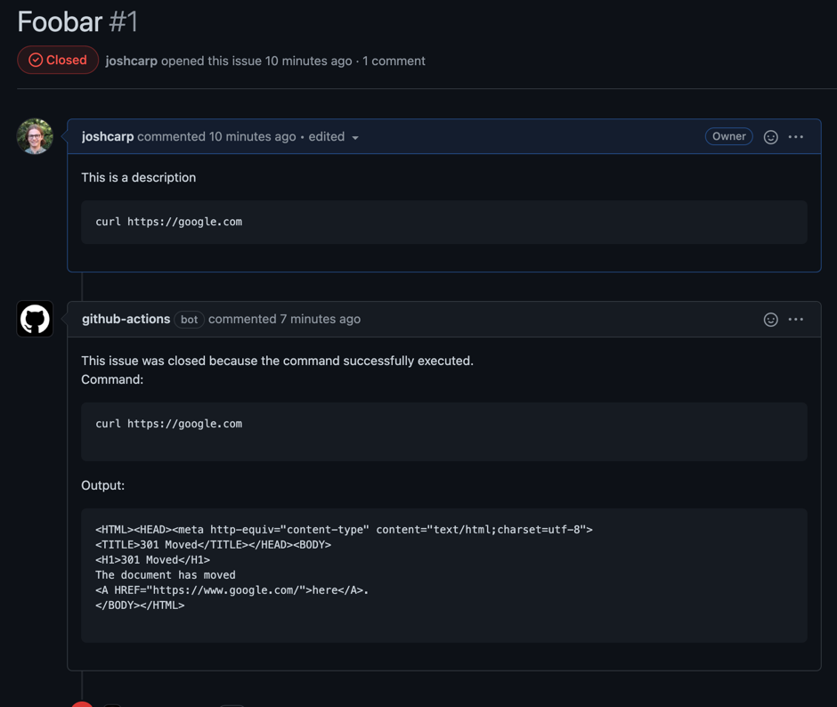

# predicate
Add predicates to github issues and automatically close issues if a predicate is met.


## Use
- Install this action on your repo with schedule trigger:
```yaml
name: github issue automation
on:
  workflow_dispatch:
  schedule:
    - cron:  '* * * * *'

jobs:
  build:
    runs-on: ubuntu-latest
    steps:
      - uses: actions/checkout@v2
      - uses: joshcarp/predicate@v0.0.6
```
- When an issue is created with a `predicate` codeblock the issue will be closed when the predicate exits with a 0 exit code

### Predicate example

---

<p>``` predicate <br>
curl https://google.com
<p>```</p>

---

<p>``` predicate <br>
cat README.md | grep foobar
<p>```</p>

---

### Example

